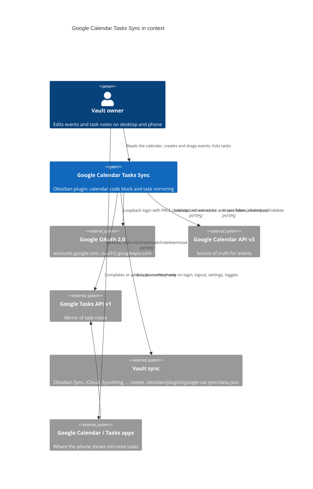
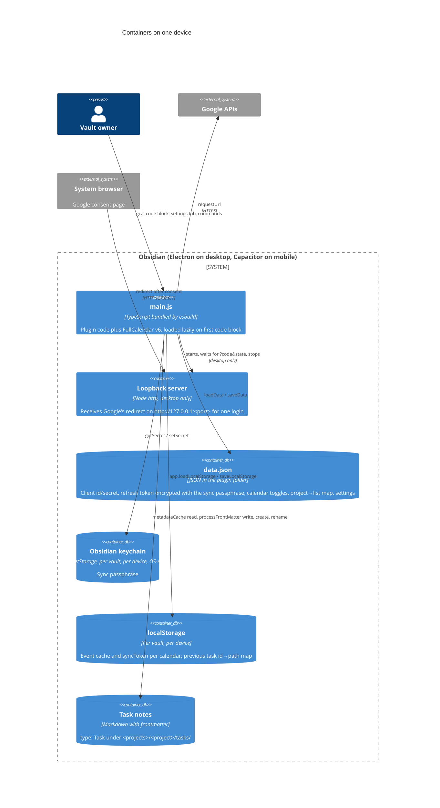
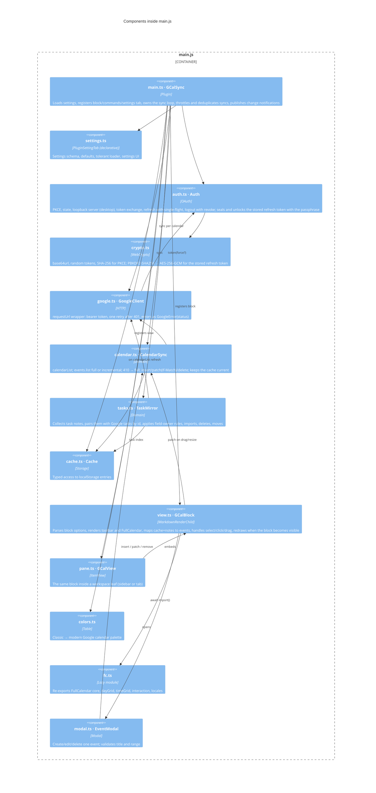
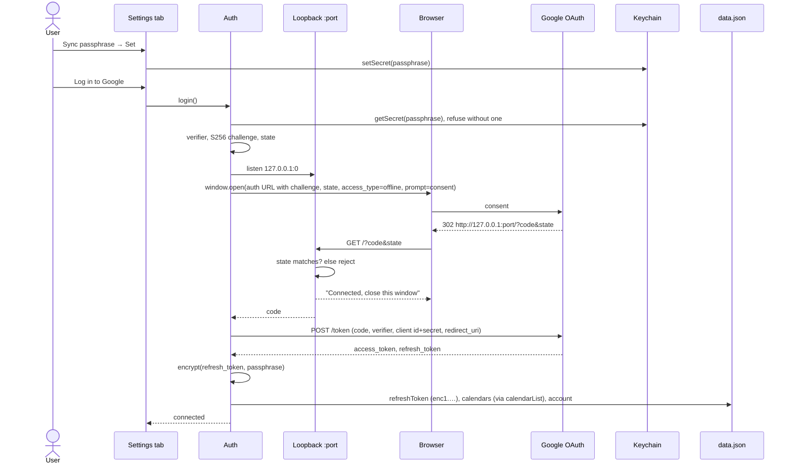

# Architecture

A [C4](https://c4model.com/) description of Google Calendar Tasks Sync: context, containers, components, the two runtime flows that matter, the data it owns, and the decisions behind the shape. Diagrams are Mermaid and render on GitHub and in Obsidian.

## Level 1: System context

Google Calendar Tasks Sync is a plugin inside Obsidian. It talks to Google on the user's behalf with an OAuth client the user created, and it relies on whatever already synchronises the vault to carry one file between devices.



Trust boundary: everything the plugin stores stays on the user's devices and in the user's own Google account. There is no server operated by the plugin author.

## Level 2: Containers

The same `main.js` runs in two hosts. The only host-specific piece is the loopback HTTP server, which exists solely during a desktop login.



Why three stores: `data.json` is copied between devices by vault sync, so it holds what every device needs (the login) and is written as rarely as possible to avoid conflict copies. The refresh token inside it is ciphertext; the passphrase that unlocks it never travels and sits in each device's keychain, which Obsidian encrypts with the operating system (Electron `safeStorage` on desktop, the iOS/Android secure store on mobile). The event cache changes on every sync and is device-local, so it lives in localStorage and never travels.

## Level 3: Components

One file per responsibility inside `src/`. Arrows are compile-time dependencies.



| Component | Depends on Obsidian for | Depends on Node for |
| --- | --- | --- |
| `auth.ts` | `requestUrl`, `Platform`, `App.secretStorage` | `http` (only inside `Platform.isDesktop`) |
| `crypto.ts` | nothing (`crypto.subtle`, `btoa`/`atob`) | nothing |
| `google.ts` | `requestUrl` | nothing |
| `calendar.ts`, `cache.ts` | `App.loadLocalStorage/saveLocalStorage` | nothing |
| `tasks.ts` | `Vault`, `MetadataCache`, `FileManager.processFrontMatter/renameFile` | nothing |
| `view.ts`, `modal.ts`, `pane.ts` | `MarkdownRenderChild`, `ItemView`, `Modal`, `Setting`, `getLanguage`, `parseYaml` | nothing |

Everything except the loopback server therefore runs unchanged on mobile, which is what lets `isDesktopOnly` be `false`.

## Runtime views

### Login (desktop, once)



The access token lives in memory and is refreshed 60 s before expiry or after a 401, on every platform, using only `requestUrl`. Concurrent callers share one refresh (single-flight).

### Unlock (every device, at start)

`data.json` arrives on another device through vault sync with the token as ciphertext. At load the plugin reads the passphrase from that device's keychain and decrypts the token into memory; the key derivation runs in the background so `onload` stays cheap. Without a passphrase, or with a wrong one, the plugin is *locked*: the block and pane show *Enter the sync passphrase in the plugin settings*, the settings tab offers an **Unlock** button, and no sync runs. Entering the passphrase there decrypts the token and stores the passphrase in the keychain, after which the device behaves like the desktop. A login written by a version before 1.2.0 is plain text; it keeps working and is encrypted the moment a passphrase is set.

### Sync (every device)

```mermaid
sequenceDiagram
    participant T as Trigger
    participant P as GCalSync.sync()
    participant C as CalendarSync
    participant M as TaskMirror
    participant G as Google
    participant LS as localStorage
    participant V as Task notes

    T->>P: block render / window focus / interval / task note changed / Sync now
    P->>P: already running? reuse. <30 s ago and not forced? skip
    loop each enabled calendar
        P->>C: sync(calendarId)
        C->>LS: read syncToken
        alt no token
            C->>G: events.list timeMin/timeMax singleEvents
        else token
            C->>G: events.list syncToken
            G-->>C: 410 → clear cache, full list
        end
        C->>LS: upsert / drop cancelled, save nextSyncToken
    end
    opt mirroring on
        P->>M: sync()
        M->>G: tasks.list per project list (create list if missing)
        M->>V: collect type: Task notes
        M->>M: pair by google_task_id (fallback: previous index by path)
        M->>G: insert / patch / move / delete
        M->>V: processFrontMatter, rename, create
        M->>LS: save id→path index
    end
    P-->>T: status {lastSyncAt | lastError}; listeners redraw
```

Triggers include metadata changes of task notes (debounced 1.5 s, forced) so that ticking a checkbox reaches Google immediately, and so the sync runs after the metadata cache has re-parsed the note the plugin itself just wrote.

### Task field ownership

Events are never merged: the last write to Google wins, protected by `If-Match` so a stale client gets a 412 and refreshes. Tasks have two writers, so each field has an owner and a tie-break:

| Field | Owner | Push to Google | Pull to note |
| --- | --- | --- | --- |
| `title` | note | when different and note is newer | when Google `updated` is newer than the file's mtime; file is renamed too |
| `due` | note | same | same |
| completion | both | `done` ↔ `completed`, anything else ↔ `needsAction` | `completed` → `done`; `needsAction` → `backlog` only if the note was `done` |
| `backlog` / `active` / `blocked`, body, other properties | note only | never sent | never touched |
| `notes` (Google) | plugin | `obsidian://` back-link | ignored |

Existence rules: a note without an id gets a task; a task without a note is imported as a note, unless the previous sync's index says a note owned it, in which case the note was deleted and the task is deleted; a task whose note moved to another project is moved with `tasks.move?destinationTasklist`.

## Data

`data.json` (synced between devices, written only on login, logout, settings and toggles):

```json
{
  "clientId": "…apps.googleusercontent.com",
  "clientSecret": "…",
  "refreshToken": "enc1.<salt>.<iv>.<ciphertext>",
  "account": "user@gmail.com",
  "calendars": { "<calendarId>": { "name": "Work", "color": "#D85B8B", "enabled": true } },
  "mirror": true,
  "projectsFolder": "10-projects",
  "taskLists": { "<project folder name>": "<Google list id>" },
  "showCompletedTasks": false,
  "hideMidnightTime": true,
  "syncIntervalMinutes": 5,
  "weekStart": "monday"
}
```

`refreshToken` is the refresh token encrypted with AES-256-GCM under a key derived from the sync passphrase by PBKDF2-HMAC-SHA256 (600,000 iterations, 16-byte salt, 12-byte IV, all base64url). A fresh salt and IV are used every time it is written. Google treats the client secret of a desktop app as public, so `clientId` and `clientSecret` stay plain.

Obsidian keychain (per vault, per device, via `app.secretStorage`):

| Id | Value |
| --- | --- |
| `google-cal-sync-passphrase` | The sync passphrase. Written when the user sets or unlocks it; never written to the vault |

localStorage (per device):

| Key | Value |
| --- | --- |
| `google-cal-sync:<calendarId>` | `{ syncToken, syncedAt, events: { [id]: { id, calendarId, title, start, end, allDay, description, location, recurringEventId, etag } } }` |
| `google-cal-sync:tasks` | `{ [googleTaskId]: notePath }` from the previous mirror run |

Task note frontmatter the plugin reads and writes: `type`, `title`, `status`, `due`, `google_task_id`. Nothing else in the note is touched.

## Decisions

| Decision | Alternatives considered | Why this one |
| --- | --- | --- |
| Google is the source of truth for events; no local queue or merge | Notes per event; offline queue | Two sources of truth need conflict code larger than the feature. Offline users still see the cache; writes simply fail with a notice |
| Notes are the source of truth for tasks; Google is a mirror | Google Tasks as master | Tasks API has two states and no custom fields; the note's `status` column and body cannot live there |
| Login on desktop only; phones reuse the refresh token through vault sync | Relay server; static HTTPS bridge page with `obsidian://` handoff | No infrastructure to run, no public redirect URI to register, nothing to keep alive. A refresh token does not expire from age alone |
| `data.json` for the login, localStorage for the cache | Everything in `data.json`; SecretStorage | Vault sync must carry the token; it must not carry a file that changes every five minutes. SecretStorage is per device and would strand phones |
| The refresh token in `data.json` is encrypted with a user passphrase; the passphrase lives in each device's keychain | Plain text (1.0 and 1.1); SecretStorage only; a static HTTPS bridge page so that every device logs in for itself | Plain text left the token in every sync copy and backup. SecretStorage alone never syncs. A bridge needs a public redirect URI and a Web client. A passphrase-derived key gives end-to-end encryption between the user's own devices with no infrastructure, and the keychain makes it a one-time entry per device |
| Scopes `calendar.calendarlist.readonly` + `calendar.events` + `tasks` | The full `calendar` scope | Least privilege: the plugin only lists calendars and reads and writes events, so a leaked token cannot share, delete or reconfigure a calendar |
| The loopback server ignores requests without this login's `state` | Reject the login on the first mismatch | A stray or hostile local request must not be able to cancel a login; the real redirect or the timeout ends it |
| FullCalendar 6, bundled, imported on first block | Hand-drawn grid; FullCalendar 7 | Month/week/day, drag, resize and touch for free under MIT. v7 needs `temporal-polyfill`, separate CSS and renamed variables; v6 injects its CSS and its `--fc-*` variables map cleanly to Obsidian's |
| Conflict tie-break by file mtime, not frontmatter `modified` | Date-only comparison | A note created today and ticked on the phone today would otherwise be reverted by the note |
| `If-Match` on every patch | Blind patch | A 412 costs one extra GET and avoids overwriting an edit made in Google Calendar between syncs |
| One `select` handler for click and drag-select | `dateClick` + `select` | With `selectable`, a single click fires both; two modals opened |
| Incremental sync with `syncToken`, first sync bounded to −3/+6 months | Time-window every time | One request per calendar per sync regardless of size; Google's own delta protocol handles deletions |
| Declarative settings tab (`getSettingDefinitions`) | Imperative `display()` | Settings become searchable in Obsidian 1.13 and the lint recommends it |
| Map calendar colours from the classic to the modern palette; refresh the list hourly | Use `backgroundColor` as returned | The API still reports the 2011 palette (`#9fe1e7`) while every Google app shows the modern one (`#039be5`); users expect the block to match their apps |
| Day cells overflow visible; redraw on becoming visible | Trust FullCalendar's defaults | Obsidian's reading view clips `td`, and FullCalendar measures columns when it draws, so multi-day bars otherwise collapse to one cell |

## Quality attributes and how they are met

| Attribute | Target | Mechanism | Evidence |
| --- | --- | --- | --- |
| Start-up cost | ≤ 50 ms added | `onload` only registers; FullCalendar and locales load on the first `gcal` block | Enable time measured at ~4 ms |
| Mobile compatibility | Same bundle on iOS/Android | No Node/Electron outside the `Platform.isDesktop` guard; `requestUrl` everywhere; no regex look-behind | `eslint-plugin-obsidianmd` recommended passes with 0 warnings; mobile emulation checked |
| API budget | ≤ 1 list call per calendar and per task list per sync | syncToken; tasks.list per project; writes only on change; 30 s throttle; single in-flight sync | e2e "request budget" step |
| Data safety | Never delete what the user did not delete | Deletions only from explicit UI actions or a note that existed in the previous index and is gone; cache untouched on failed requests | e2e steps for 412, 410, deletions |
| Theme fit | No literal colours | `--fc-*` mapped to Obsidian CSS variables; only Google's calendar colours are inline | `styles.css` |
| Secrets at rest | No plain-text refresh token in any synced file | AES-256-GCM under a PBKDF2 key from the sync passphrase; passphrase in the OS-encrypted keychain; decrypted token only in memory; least-privilege scopes | Unit tests: round trip, wrong passphrase, two-device unlock; e2e: login refuses to start without a passphrase |

## Testing

- `npm test`: node:test over the pure logic (settings loader, block options, event mapping, `GoogleClient` retry and errors, `CalendarSync` full/incremental/410/pagination, 412 handling) with an `obsidian` stub.
- `tests/e2e/`: scripts run inside a development vault against a fake Google transport swapped in at the `GoogleClient.send` level, so `GoogleError` handling is the real code. They cover the whole task ruleset, the calendar write paths and the UI wiring; `login-test.js` drives the loopback server with a fake browser up to the real token endpoint.
- GitHub Actions runs build, lint and unit tests on Node 20, 22 and 24; release-please keeps a release pull request open on `master`, and merging it tags the commit, publishes the GitHub release and attaches the attested build assets.
